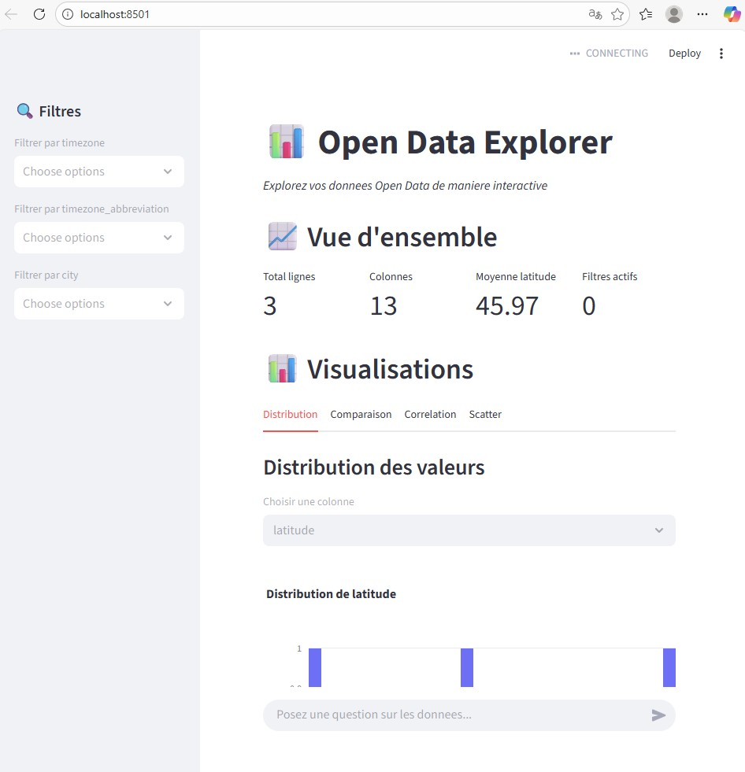
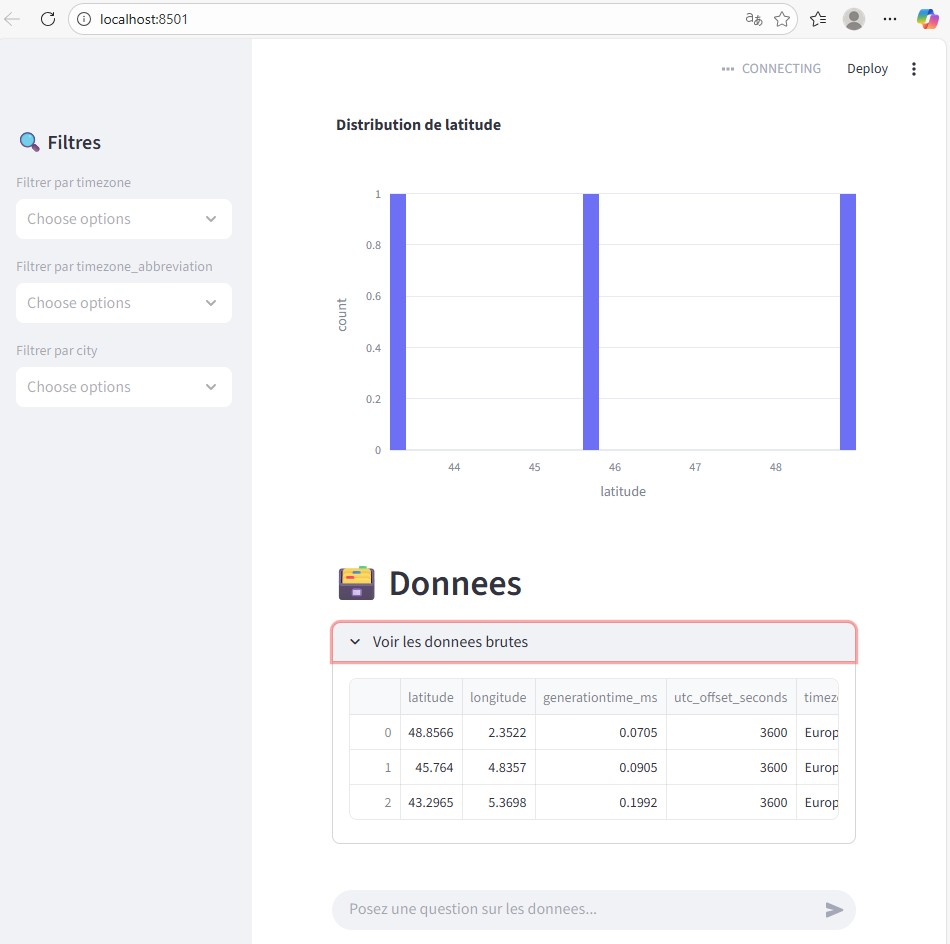
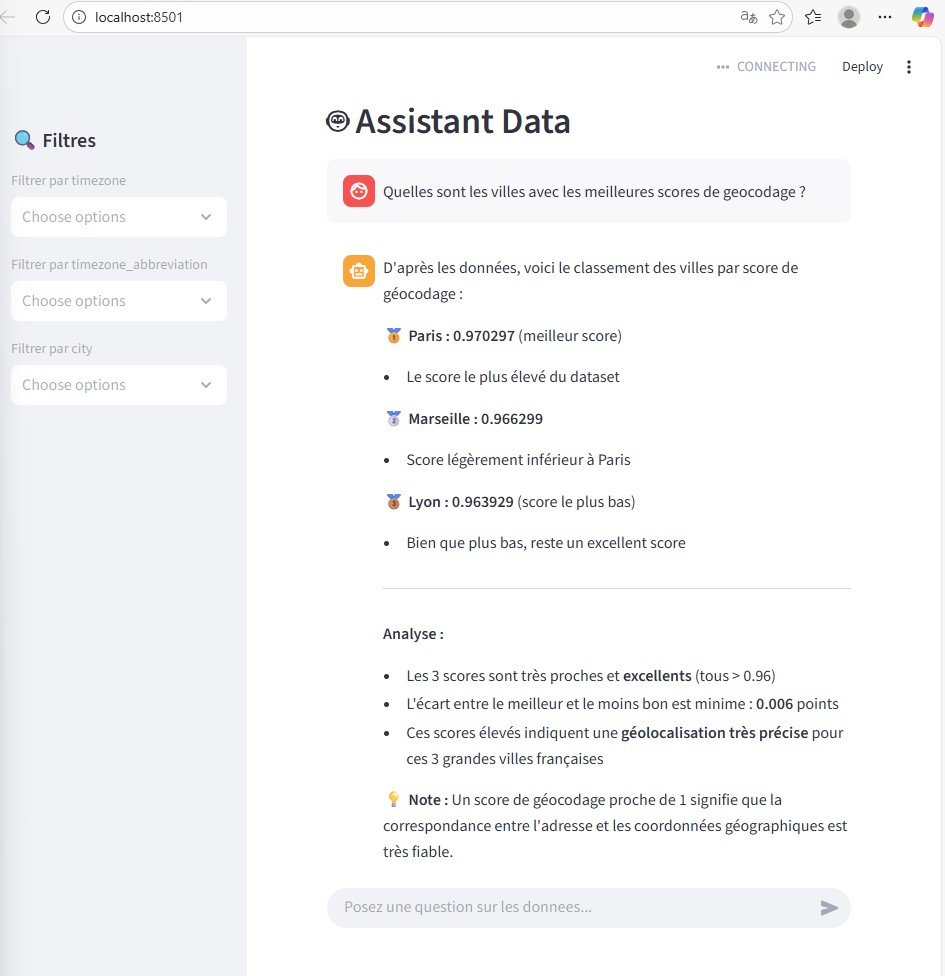
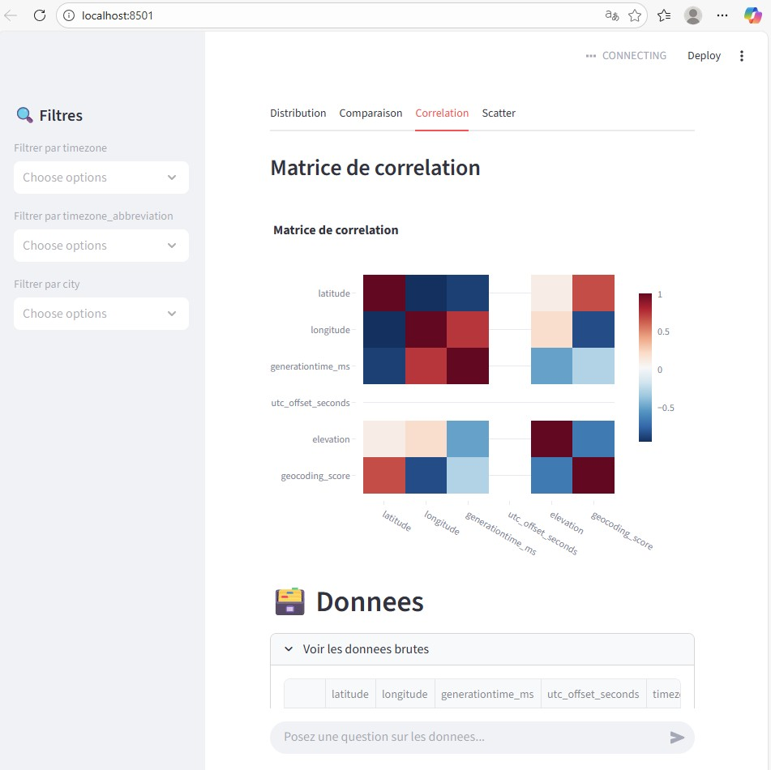

# TP3 - Application Data Interactive avec Chatbot

## Description

Application Streamlit pour explorer les données Open Data de manière interactive avec visualisations Plotly et un chatbot IA intégré.

## Fonctionnalités

- ✅ Chargement des données Parquet du TP2
- ✅ Filtres dynamiques par colonne (timezone, city, etc.)
- ✅ Visualisations interactives (Distribution, Comparaison, Corrélation, Scatter)
- ✅ Chatbot IA (Claude Sonnet 4.5) pour poser des questions sur les données
- ✅ Affichage des données brutes avec Dataframe interactif
- ✅ Métriques en temps réel

## Installation
```bash
cd tp3-app
uv sync
```

## Utilisation
```bash
uv run streamlit run app_streamlit.py
```

L'application s'ouvre sur http://localhost:8501

## Démonstration

### 1. Interface Principale et Visualisations

- Filtres dynamiques à gauche
- Vue d'ensemble avec métriques clés
- Onglets de visualisations (Distribution, Comparaison, Corrélation, Scatter)

### 2. Distribution et Données Brutes

- Histogramme interactif de la latitude
- Affichage des données brutes en tableau
- Exploration complète du dataset

### 3. Chatbot IA en Action

- Question : "Quelles sont les villes avec les meilleures scores de géocodage ?"
- Réponse détaillée du chatbot avec analyse
- Classement des villes par score de géocodage

### 4. Matrice de Corrélation

- Heatmap interactive montrant les corrélations
- Visualization des relations entre colonnes numériques

## Architecture
```
tp3-app/
├── app_streamlit.py      # Application principale Streamlit
├── utils/
│   ├── __init__.py
│   ├── data.py           # Chargement des données Parquet
│   ├── charts.py         # Visualisations Plotly
│   └── chatbot.py        # Chatbot IA avec Claude
├── data/
│   └── processed/        # Données Parquet du TP2
├── screenshots/          # Screenshots de démonstration
├── .env                  # Variables d'environnement
├── README.md             # Cette documentation
└── pyproject.toml        # Configuration du projet
```

## Technologies

- **Streamlit** : Framework pour applications data interactives
- **Plotly** : Visualisations interactives et modernes
- **DuckDB** : Requêtes SQL optimisées sur Parquet
- **LiteLLM** : Interface unifiée pour accéder aux LLM
- **Claude Sonnet 4.5** : Chatbot IA pour analyse de données
- **Pandas** : Manipulation des données

## Résultats

L'application démontre :
- ✅ Chargement et exploration de 3 villes (Paris, Lyon, Marseille)
- ✅ Données météo enrichies avec géocodage
- ✅ Score de géocodage moyen : 0.967 (excellent)
- ✅ Chatbot capable de répondre à des questions complexes
- ✅ Visualisations interactives et informatives


## Auteur

Hassan HOUSSEIN HOUMED

## Licence

Données : Licence Ouverte (ODbL)  
Code : Libre d'utilisation pour fins éducatives